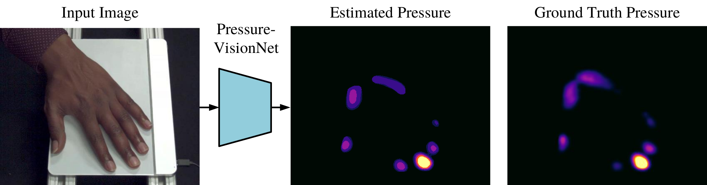

# PressureVision: Estimating Hand Pressure from a Single RGB Image



This repository contains the code, models, and data used in the PressureVision paper. By observing small changes in the appearance of the hand such as tissue deformation, blood flow, pose changes, and cast shadows, PressureVision estimates the pressure an uninstrumented hand exerts on a surface from a single RGB image.

[[Paper]](https://arxiv.org/abs/2203.10385)

## Installation

PressureVision requires Python and PyTorch, and has been tested with Python 3.8 and Pytorch 1.8 on Ubuntu. We recommend creating a fresh conda environment with these dependencies.

Install the project-specific dependancies with:
```
pip install -r requirements.txt
```

## Downloading the PressureVisionDB Dataset

PressureVisionDB consists of 36 participants recorded by 4 cameras for 16 hours. The videos are saved as individual images to facilitate deep-learning dataloaders, however this results in a very large dataset. The dataset used in the paper was sampled at 15 FPS, resulting in a 960 GB download. This dataset and model weights can be downloaded with the following command:

```
python -m recording.downloader
```

TODO: We will release a more compressed dataset to enable easier experimentation.

## Getting Started

To run PressureVisionNet on the validation set of the dataset and generate a video of the results, run:
```
python -m prediction.make_network_movie --config paper
```

To run PressureVisionNet on a realtime webcam stream, run:
```
python -m prediction.webcam_demo --config paper
```

## Training and Evaluating

To train PressureVisionNet using the same hyperparameters as used in the paper, run:

```
python -m prediction.trainer --config paper
```

To generate the metrics used in the paper, run the following command:

```
python -m prediction.evaluator --config paper --eval_on_test_set
```

## Other helpful commands

To visualize the raw data from a random sequence in the PressureVisionDB dataset, run:
```
python -m recording.view_recording
```

The code for this project is released under the MIT License